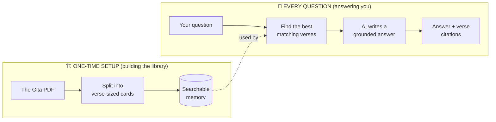
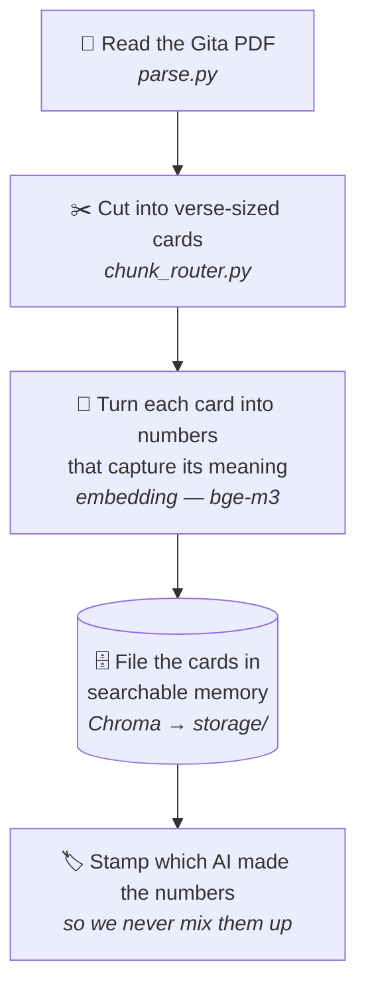
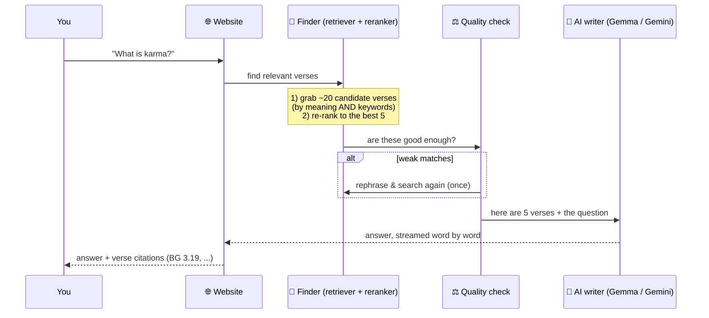
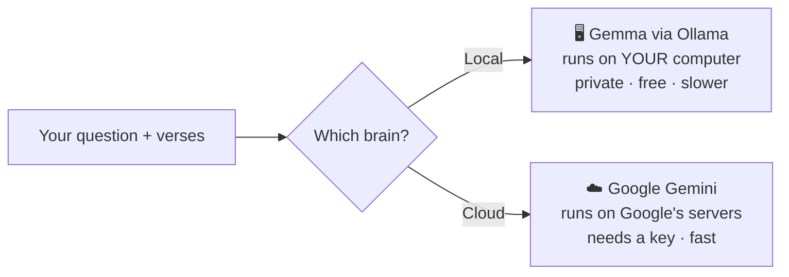

# How GITAGPT Works — A Visual Guide for Everyone

This guide explains what GITAGPT is and what happens inside it, in plain language.
No programming knowledge needed. If you *are* a developer, the file/function names
are noted along the way.

---

## 1. What is GITAGPT, in one breath?

GITAGPT is a **question-answering assistant for the Bhagavad-gita "As It Is."**
You ask a question in plain English; it finds the most relevant verses and
commentary from the book and writes an answer **grounded in the text**, citing the
exact verses (like *BG 2.47*). It does **not** make things up — if the book doesn't
address something, it says so.

> **The librarian analogy** 📚
> Imagine a wise librarian who has read the entire Gita, remembers which page
> discusses what, and — when you ask a question — pulls the exact passages off the
> shelf and summarizes them for you, always pointing to the source. GITAGPT is that
> librarian, built in software.

---

## 2. The big picture

There are **two separate jobs**. The first happens **once** (setting up the
library). The second happens **every time you ask a question**.



---

## 3. Map of the project (what each folder is for)

Think of the repo as a workshop. Here's what's in each drawer:

```
GITAGPT/
├── Docs/                  📖 The source book (the Gita PDF lives here)
├── app/                   🧠 The actual application
│   ├── ingest/               🏗️  Setup crew: reads the PDF, cuts it into cards
│   ├── vectorstores/         🗄️  The filing cabinet (searchable memory)
│   ├── providers/            🔌 Adapters: talk to the AI (local or Google Gemini)
│   ├── rag/                  🎯 The brain: find verses → decide → write answer
│   ├── api/                  🌐 The front desk: the website you talk to
│   └── ui/                   🎨 What the web page looks like
├── eval/                  ✅ Quality checks (is it answering correctly?)
├── logs/                  📊 Records of every question (speed, tokens, traces)
├── storage/              💾 The saved searchable memory (built once, reused)
├── config.py             ⚙️  Settings (which AI, which models, etc.)
└── .env                   🔑 Your private settings & keys (never shared)
```

### The workshop crew, by name (for developers)

| Folder | Key files | Job |
|---|---|---|
| `app/ingest` | `parse.py`, `chunk_router.py`, `build_index.py` | Turn the PDF into searchable verse-cards |
| `app/vectorstores` | `chroma_store.py` | Store & search those cards |
| `app/providers` | `llm_factory.py`, `embedding_factory.py` | Swap between local AI and Gemini |
| `app/rag` | `retriever.py`, `reranker.py`, `graph.py`, `service.py` | Find the right verses and write the answer |
| `app/api` | `main.py`, `routes.py` | Serve the website & handle requests |
| `app/rag` | `query_log.py`, `local_tracer.py` | Record what happened, for tuning |

---

## 4. Journey 1 — Building the library (the one-time setup)

This runs when you type `python -m app.ingest.build_index`. It happens **once**
(or again only if you change the source book).



**In plain words:**

1. **Read the book.** The PDF is read page by page. (The old scan garbles the
   Sanskrit accent marks, but the English translation and commentary come through
   clean — and that's what we search.)
2. **Cut it into cards.** Instead of chopping the book every 500 words (which would
   split sentences), GITAGPT is *structure-aware*: it makes **one card per verse**,
   keeping each verse's translation and commentary together, tagged with its
   chapter and verse number. (~718 cards from the Gita.)
3. **Turn meaning into numbers.** Each card is converted into a long list of numbers
   called an **embedding** — think of it as a "meaning fingerprint." Cards about
   similar ideas get similar fingerprints.
4. **File them away.** All the cards + fingerprints go into a local searchable
   database (**Chroma**), saved to `storage/` so it's ready instantly next time.

> **Why "meaning fingerprints"?** So that when you later ask *"how should I do my
> duty?"*, the system can find the verse about *acting without attachment to
> results* — even though your words don't match the verse's words. It matches on
> **meaning**, not keywords.

---

## 5. Journey 2 — Answering your question (every time)

This is what happens the moment you hit **Send** in the chat box.



**Step by step, in plain words:**

1. **You ask a question** in the chat box on the website (`app/api` + `app/ui`).
2. **Find candidate verses two ways** (`retriever.py`):
   - by **meaning** (fingerprint match), and
   - by **keywords** (great for special terms like *dharma*, *karma*, *atma*).
   - This "best of both" approach is called **hybrid search**.
3. **Pick the very best 5** (`reranker.py`): a second, pickier model re-reads the
   ~20 candidates against your exact question and keeps only the top 5.
4. **Quality check** (`graph.py`): if the best matches look weak, the system
   **rephrases your question and searches once more** — like a librarian saying
   "let me try different keywords." (This is the "CRAG" loop.)
5. **The AI writes the answer** (`service.py` + `providers/`): the 5 verses plus
   your question are handed to the AI, with strict instructions: *use only these
   passages, cite the verses, and if they don't answer it, say so.* The answer
   **streams back word-by-word** so you see it as it's written.
6. **You get an answer with citations** like *(BG 2.47)* — and chips showing the
   source verses and page numbers.

> **The most important rule:** the AI is only allowed to use the verses it was
> handed. This is what keeps answers faithful to the book instead of invented.
> This technique — *find real documents first, then let the AI write from them* —
> is called **RAG (Retrieval-Augmented Generation).**

---

## 6. Two "brains" you can choose

GITAGPT can use either AI, selected from the dropdown in the app. Nothing else
changes — the finding-verses part is identical.



| | 🖥️ Local (Ollama / Gemma) | ☁️ Gemini (Google) |
|---|---|---|
| Where it runs | Your own computer | Google's servers |
| Privacy | Fully private, offline | Question is sent to Google |
| Cost | Free | Needs an API key |
| Speed | Slower (depends on your PC) | Fast |

---

## 7. What gets recorded (so you can see under the hood)

Every question quietly writes two kinds of records to the `logs/` folder — no cloud
required:

- **`logs/queries.jsonl`** — a quick scorecard per question: how long it took, how
  many words (tokens) went in and out, and the speed (words per second).
- **`logs/traces.jsonl`** — the **full step-by-step trace**: every stage (find →
  check → write), what went into it and came out, and how long each took. This is
  the same kind of "x-ray view" that the paid LangSmith service shows — here it's
  generated locally. (Any secret keys are automatically blanked out.)

You'll also see a one-line summary printed in the terminal after each answer:

```
[query] local/gemma4:e4b retrieval=16.2s total=349.0s tokens=1639+867 prefill=22.5 tok/s decode=3.7 tok/s
Q: What is devotion?
A: Devotion (bhakti) is described as ...
```

---

## 8. Mini-glossary (plain definitions)

| Term | Plain meaning |
|---|---|
| **RAG** | "Look it up first, then answer." Find real passages, then let the AI write from them. |
| **Chunk / card** | A bite-sized piece of the book (here: one verse + its commentary). |
| **Embedding / fingerprint** | A list of numbers that captures a piece of text's *meaning*, so similar ideas can be matched. |
| **Vector store** | The searchable filing cabinet that holds all the cards and their fingerprints (we use **Chroma**). |
| **Hybrid search** | Finding passages by *meaning* AND by *keywords*, then combining. |
| **Reranker** | A pickier second model that sorts the candidates to keep only the best few. |
| **LangGraph** | The "flowchart engine" that runs the find → check → rephrase → write steps. |
| **Prefill** | The AI *reading* your question + the verses (before it starts replying). |
| **Decode** | The AI *writing* the answer, word by word. |
| **Token** | Roughly a word-piece; AIs measure text in tokens. |
| **Ollama** | A tool that runs AI models locally on your own computer. |
| **Citation (BG x.y)** | A pointer to Bhagavad-gita chapter *x*, verse *y* — the source of a claim. |

---

## 9. The 30-second summary

1. **Once:** the Gita is cut into verse-cards, each turned into a "meaning
   fingerprint," and filed into a searchable memory.
2. **Each question:** GITAGPT finds the best-matching verses (by meaning + keywords),
   double-checks them, and hands them to an AI that writes an answer **using only
   those verses**, with citations.
3. **You choose** whether the AI runs privately on your computer (Gemma) or in the
   cloud (Gemini).
4. **Everything is logged locally** so you can see exactly what happened and how fast.
```
